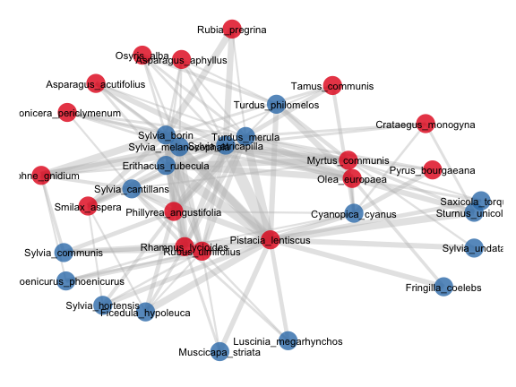

Plotting bipartite networks
========================================================

This is a series of `R` script files aimed to plot bipartite networks. Bipartite networks are a special type of network where nodes are of two distinct types or sets, so that connections (links) only exist among nodes of the different sets.

As in other types of network, bipartite strucures can be binary (only the presence/absence of the links is mapped) or quantitative (weighted), where the links can have variable importance or weight.

To plot, we start with an adjacency or incidence matrix. I'm using matrices that illustrate ecological interactions among species, such as the mutualisttic interactions of animal pollinators and plant flowers. The two sets (modes) of these bipartite netwroks are animals (pollinators) ans plants species.

From any adjacency matrix we can get a `network` object or an `igraph` object for plotting and analysis. 

-----------------------------------------------------------------------------
### Required packages

```r
require(network)
require(igraph)
require(sna)
require(ggplot2)
require(sna)
require(ergm)
```


Here I plot bipartite networks from their adjacency matrices, i.e., the two-mode networks.

### Initializing bipartite webs for library network


```r
# Read data matrices.
# Read a network
# Creating the objects. Example. 
mymat <- read.delim("data.txt", row.names=1)
# Where data.txt has weighted adjacency matrix,e.g.,:
    Aa	Ab	Ac	Ba	Bb	Bc	Bd	Ca	Cb	Cc	Da
P1	139	112	 9	73	4	14	20	14	5	2	1
P2	184	26	6	19	31	21	17	11	7	5	0
P3	281	74	33	36	18	29	5	9	5	3	0
P4	87	40	38	21	13	12	9	1	1	0	0
P5	100	93	27	12	8	11	32	0	0	0	0
P6	51	25	13	17	9	1	0	0	0	0	0
P7	42	26	16	0	2	0	0	0	0	0	0
P8	31	18	14	15	12	9	7	1	0	0	0
P9	46	12	6	0	3	0	0	0	0	0	0
P10	136	0	0	12	0	2	2	0	0	0	0
P11	130	8	0	5	0	0	0	0	0	0	0

# Use this to copy from the clipboard, after select/copy the above block.
mymat <- read.table(pipe("pbpaste"), header=T, sep= "\t",row.names=1)
```


The adjacency matrix is read as tab-separated file with header names, and the first column is taken as the row names. These are two of my datasets of well-sampled plant-frugivore interaction networks.


```r
# The Nava de las Correhuelas dataset.
nch <- read.table("./data/NCH_quant_bmatrix.txt", header = T, sep = "\t", row.names = 1, 
    dec = ",", na.strings = "NA")
# The Hato Raton dataset.
hr <- read.table("./data/HR_quant_bmatrix.txt", header = T, sep = "\t", row.names = 1, 
    dec = ".", na.strings = "NA")
```


----------------------------------------------------------------------------
Here I use my function `bip_init` to initialize the bipartite networks.


```r
source("./functions/bip_init_network.R")
source("./functions/bip_init_igraph.R")
nch.net <- bip_init_network(nch)
hr.net <- bip_init_network(hr)
```

----------------------------------------------------------------------------
### Functions to plot network graphs

#### bip_binplot
Simple function to plot a binary bipartite network in `network`.

#### bip_qtplot
Function to plot a weighted bipartite network in `network` object.

#### bip_gplot
Function to plot a weighted bipartite network in `igraph`.

#### bip_ggplot
This is just a prototype of function. I'm using it as raw code for now. You assign the matrix and network object at the start (see below).

In addition, my function `vectorize` is needed in the section using `ggplot2`.


```r
# Sourcing required functions and initializing the net objects.
source("./functions/bip_binplot.R")
source("./functions/bip_gplot.R")
source("./functions/bip_qtplot.R")
source("./functions/vectorize.R")
nch.net <- bip_init_network(nch)
hr.net <- bip_init_network(hr)
```


----------------------------------------------------------------------------
### Using ggplot2
#### Draft code for plotting a bipartite network in ggplot2

The code for `ggplot2` is in the file `bip_ggplot2.R`. It is not a function
yet. But we just source it after assigning the input adjacency matrix and
the input graph:


```r
require(network)
require(ggplot2)
require(sna)
require(ergm)
# Assign the matrix and the network objects here.  mymat is a matrix with
# column names and row names.  net is a network object.  This is for the
# Nava de las Correhuelas network.
mymat <- nch
net <- nch.net
# Now we source the bip_ggplot2.R file
source("bip_ggplot2.R")
```

 

```r
# We repeat for the Hato Raton network.
mymat <- hr
net <- hr.net
source("bip_ggplot2.R")
```

 


----------------------------------------------------------------------------

